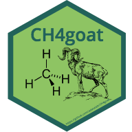

# CH4goat 

## Overview
CH4goat is a deep learning models for calculate the methane emission from goats :goat:. It contains two black-box model (model1 & model2) using the dataset from Konkuk University.

## Installation  
``` r
# The development version from GitHub:
# install.packages("devtools")
devtools::install_github("adatalab/CH4goat")
```

## Usage
### base_frame
``` r
# making a base frame for predict the methane emission from goats
base_frame(model = 1) # use when using model1 (inputs = DMI, OMI, CPI, NDFI, DDMI, DOMI, DCPI, and DNDFI)
base_frame(model = 2) # use when using model2 (inputs = DMI, OMI, CPI, and NDFI)

# OR read the example excel file

example1 <- readxl::read_excel("model1-example.xlsx")
```
- [model1-example1.xlsx](https://github.com/YoungjunNa/CH4goat/blob/master/model1-example.xlsx)
- [model1-example2.xlsx](https://github.com/YoungjunNa/CH4goat/blob/master/model2-example.xlsx)

### normalization
``` r
example1_nor <- normalization(example1, model=1)
```

### compute
``` r
# calculating the methane emission from goats using deep learning model.
result <- neuralnet::compute(model1, example1_nor)$net.result
```

### back-normalization
``` r
back_normalization(result$net.result) # unit is L/d
```

## Youtube tutorial
https://youtu.be/nfOxvrhkmy0

## Notification
This package is under development. Everyone can contribute to this package. **If you have the *in vivo* data of goats and want to progress this model, please contact via [email](ruminoreticulum@gmail.com) or github. :goat:**


## Getting helps
Email: ruminoreticulum@gmail.com
